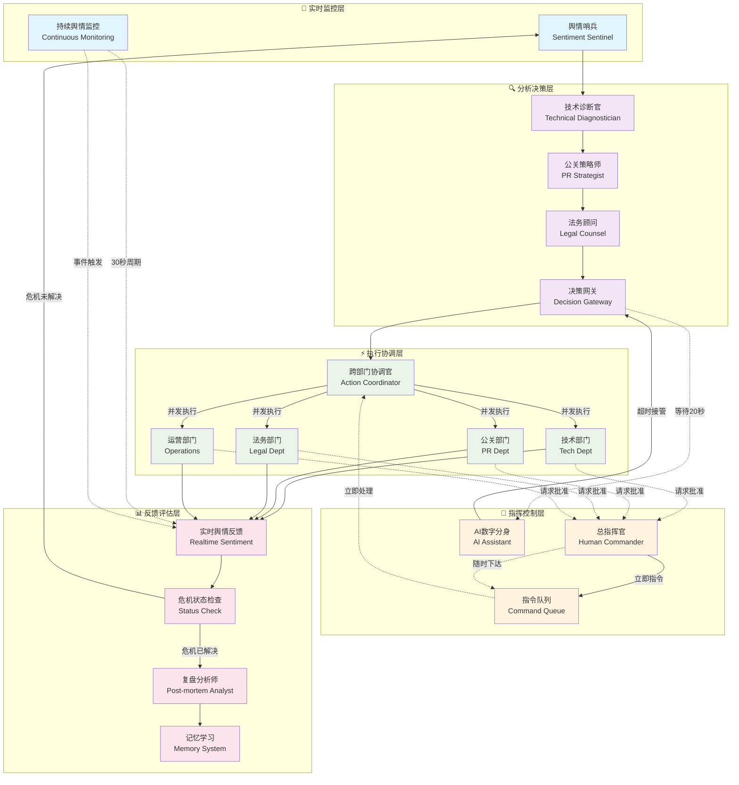
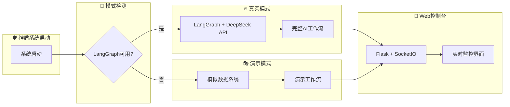

# 🛡️ AEGIS Crisis Management System

一个基于 LangGraph 和 DeepSeek API 的智能危机管理系统，具备实时舆情监控、多智能体协同决策和总指挥官指令处理能力。

## ✨ 核心特性

### 🔥 智能危机响应
- **实时舆情监控**：自动监测和分析危机事件
- **多维度分析**：技术诊断、公关策略、法律风险评估
- **智能决策支持**：AI数字分身在关键时刻自动接管决策

### 🎯 多智能体协同
- **舆情哨兵**：持续监控社交媒体和用户反馈
- **技术诊断官**：快速识别和分析技术问题
- **公关策略师**：制定针对性的危机公关方案
- **法务顾问**：评估法律风险和合规性
- **跨部门协调官**：统筹各部门并发执行

### 👑 总指挥官系统
- **实时指令下达**：支持随时介入和调整策略
- **批准请求机制**：关键决策需要总指挥官确认
- **AI分身备份**：20秒无响应时AI自动接管
- **记忆学习**：系统会记住每次危机处理的经验

### 🖥️ 实时监控大屏
- **智能体状态**：实时显示所有智能体的工作状态
- **系统信息面板**：危机警报、技术报告、公关策略等
- **指令控制台**：总指挥官可随时下达指令
- **危机状态确认**：支持确认危机是否已解决

## 🚀 快速开始

### 前置要求
- Python 3.8+
- Node.js (用于前端依赖，可选)

### 安装步骤

1. **克隆仓库**
```bash
git clone https://github.com/yourusername/aegis-crisis-management.git
cd aegis-crisis-management
```

2. **安装依赖**
```bash
pip install -r requirements.txt
```

3. **配置环境变量**
```bash
# 复制环境变量模板
cp .env.example .env

# 编辑 .env 文件，添加你的 DeepSeek API 配置
DEEPSEEK_API_KEY=your_api_key_here
DEEPSEEK_BASE_URL=https://api.deepseek.com
DEEPSEEK_MODEL=deepseek-chat
```

4. **启动系统**
```bash
python web_app_working.py
```

5. **访问控制台**
打开浏览器访问：`http://localhost:5000`

## 🏗️ 系统架构

### 核心模块
```
aegis_system/
├── agents.py          # 智能体实现
├── state.py           # 状态管理
├── graph.py           # LangGraph 工作流
├── memory.py          # 长期记忆模块
└── __init__.py        # 模块初始化
```

### Web 界面
```
templates/
└── index.html         # 主控制台界面

web_app_working.py     # Flask 主应用
```

### 系统架构流程图



### 双模式运行架构



### 关键特性说明

- **🔄 循环处理**：危机未解决时系统会自动进入下一轮处理
- **⚡ 立即响应**：总指挥官可随时下达指令，立即执行不中断主流程
- **🤖 AI接管**：20秒无人类响应时AI数字分身自动接管决策
- **📊 持续监控**：舆情监控线程30秒周期更新或事件触发更新
- **✅ 批准机制**：关键行动需要总指挥官批准，支持超时自动批准
- **🧠 学习记忆**：每次危机处理结果都会被记录用于未来参考
- **🎯 并发执行**：多个部门可以同时执行不同任务提高效率

## 🎮 使用指南

### 启动系统
1. 点击"启动神盾系统"按钮
2. 系统会自动开始第一轮危机检测
3. 总指挥官可随时在右上角输入框下达指令

### 处理危机
1. **监控阶段**：舆情哨兵检测到危机事件
2. **分析阶段**：技术、公关、法务三个维度并行分析
3. **决策阶段**：等待总指挥官指令（20秒后AI接管）
4. **执行阶段**：各部门并发执行分配的任务
5. **反馈阶段**：实时舆情监控和效果评估
6. **检查阶段**：确认危机是否已解决

### 指令示例
- `立即修复服务器问题，技术团队全力投入`
- `发布官方道歉声明，安抚用户情绪`
- `启动用户补偿方案，公关部门跟进`
- `法务部门准备应急预案，评估法律风险`

## 🔧 配置说明

### 环境变量
| 变量名 | 说明 | 默认值 |
|--------|------|--------|
| `DEEPSEEK_API_KEY` | DeepSeek API 密钥 | 必填 |
| `DEEPSEEK_BASE_URL` | API 基础URL | `https://api.deepseek.com` |
| `DEEPSEEK_MODEL` | 使用的模型 | `deepseek-chat` |

### 运行模式
- **真实模式**：需要配置 DeepSeek API，使用 LangGraph 工作流
- **演示模式**：API 配置失败时自动启用，使用模拟数据

## 🤝 贡献指南

欢迎提交 Issue 和 Pull Request！

### 开发环境设置
```bash
# 安装开发依赖
pip install -r requirements.txt

# 运行测试
python test_approval_system.py
```

### 代码规范
- 使用 Python 3.8+ 语法
- 遵循 PEP 8 代码规范
- 添加适当的注释和文档字符串

## 📄 许可证

本项目采用 MIT 许可证，详见 [LICENSE](LICENSE) 文件。

## 🙏 致谢

- [LangChain](https://langchain.com/) - 强大的 LLM 应用框架
- [LangGraph](https://langchain-ai.github.io/langgraph/) - 状态图工作流引擎
- [DeepSeek](https://www.deepseek.com/) - 高质量的 AI 模型服务
- [Flask](https://flask.palletsprojects.com/) - 轻量级 Web 框架
- [Socket.IO](https://socket.io/) - 实时通信支持

## 📞 联系方式

如有问题或建议，请通过以下方式联系：
- 提交 [GitHub Issue](https://github.com/yourusername/aegis-crisis-management/issues)
- 发送邮件至：your.email@example.com

---

⚡ **快速体验**：无需配置 API 即可运行演示模式，感受完整的危机管理流程！ 